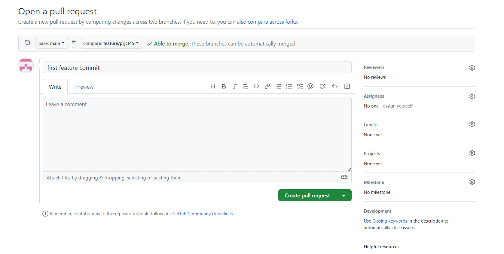

# ANSIBLE CONFIGURATION MANAGEMENT – AUTOMATE PROJECT 7 TO 10

## In this project, we will perform the following tasks

## Install and configure Ansible client to act as a Jump Server/Bastion Host

1. Update Name tag on your Jenkins EC2 Instance to Jenkins-Ansible. We will use this server to run playbooks.

2. In your GitHub account create a new repository and name it ansible-config-mgt.

    #Install Ansible

    $ `sudo apt update`

    $ `sudo apt install ansible`

Check your Ansible version by running `ansible --version`

## Configure Jenkins build job to save your repository content every time you change it

1. Create a new Freestyle project ansible in Jenkins and point it to your ‘ansible-config-mgt’ repository.

2. Configure Webhook in GitHub and set webhook to trigger ansible build.

3. Configure a Post-build job to save all (**) files, like you did it in Project 9

4. Test your setup by making some change in README.MD file in master branch and make sure that builds starts automatically and Jenkins saves the files (build artifacts) in following folder

/var/lib/jenkins/jobs/ansible/builds/<build_number>/archive/

5. Installe Visual Studio Code, configure it to connect to your newly created GitHub repository.

6. Clone down your ansible-config-mgt repo to your Jenkins-Ansible instance

     git clone <ansible-config-mgt repo link>

## Create a simple Ansible playbook to automate servers configuration

1. In your ansible-config-mgt GitHub repository, create a new branch that will be used for development of a new feature

2. Checkout the newly created feature branch to your local machine and start building your code and directory structure

3. Create a directory and name it playbooks – it will be used to store all your playbook files.

4. Create a directory and name it inventory – it will be used to keep your hosts organised

5. Within the playbooks folder, create your first playbook, and name it common.yml

6. Within the inventory folder, create an inventory file (.yml) for each environment (Development, Staging Testing and Production) dev, staging, uat, and prod respectively

## Set up an Ansible Inventory

Update your inventory/dev.yml file with this snippet of code

    [nfs]
    <NFS-Server-Private-IP-Address> ansible_ssh_user='ec2-user'

    [webservers]
    <Web-Server1-Private-IP-Address> ansible_ssh_user='ec2-user'
    <Web-Server2-Private-IP-Address> ansible_ssh_user='ec2-user'

    [db]
    <Database-Private-IP-Address> ansible_ssh_user='ec2-user' 

    [lb]
    <Load-Balancer-Private-IP-Address> ansible_ssh_user='ubuntu'

 

## Setup SSH agent 

Ansible uses TCP port 22 by default, which means it needs to ssh into target servers from Jenkins-Ansible host – for this you can implement the concept of ssh-agent

$ `eval ssh-agent -s`

$ `ssh-add <path-to-private-key>`

Confirm the key has been added with the command below, you should see the name of your key

$ `ssh-add -l`

Now, ssh into your Jenkins-Ansible server using ssh-agent

$ `ssh -A ubuntu@public-ip`

## CREATE A COMMON PLAYBOOK

It is time to start giving Ansible the instructions on what you needs to be performed on all servers listed in inventory/dev.

Update your playbooks/common.yml file with following code:

    ---
    - name: update web, nfs and db servers

     hosts: webservers, nfs, db

     remote_user: ec2-user

     become: yes 

     become_user: root  

     tasks:

       - name: ensure wireshark is at the latest version

         yum:

           name: wireshark

           state: latest

    - name: update LB server

     hosts: lb

     remote_user: ubuntu

     become: yes

     become_user: root

     tasks:

        - name: Update apt repo

          apt: 

            update_cache: yes

        - name: ensure wireshark is at the latest version

          apt:

            name: wireshark

            state: latest

 
## Update GIT with the latest code and create a pull request

Now all of your directories and files live on your machine and you need to push changes made locally to GitHub

$ `git status`

$ `git add <selected files>`

$ `git commit -m "commit message"`

Create a Pull request (PR) and merge the code to the master branch.

Head back on your terminal, checkout from the feature branch into the master, and pull down the latest changes

Once your code changes appear in master branch – Jenkins will do its job and save all the files (build artifacts) to /var/lib/jenkins/jobs/ansible/builds/<build_number>/archive/ directory on Jenkins-Ansible server.

## RUN FIRST ANSIBLE TEST

Now, it is time to execute ansible-playbook command and verify if your playbook actually works:

$ `cd ansible-config-mgt`

$ `ansible-playbook -i inventory/dev.yml playbooks/common.yml`

You can go to each of the servers and check if wireshark has been installed by running which wireshark or wireshark --version

